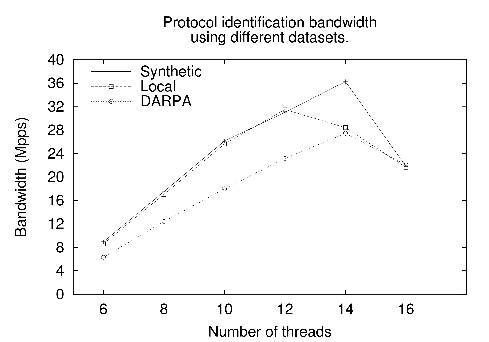
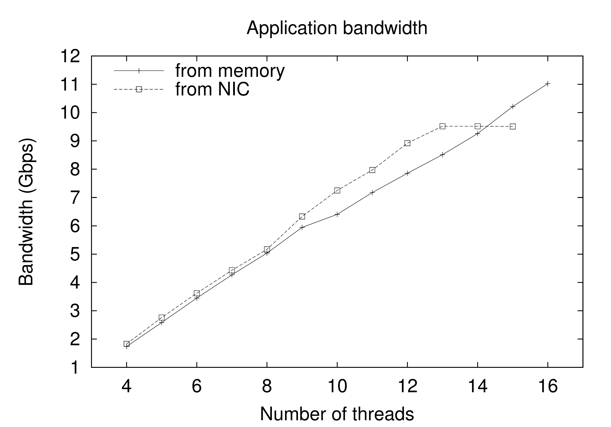

[](https://travis-ci.org/DanieleDeSensi/peafowl) 
[](https://github.com/danieledesensi/peafowl/releases/latest)
[](https://www.codefactor.io/repository/github/danieledesensi/peafowl/)
[](http://hits.dwyl.io/DanieleDeSensi/Peafowl)
[](https://opensource.org/licenses/mit-license.php)
[](http://paypal.me/DanieleDeSensi)
<noscript><a href="https://liberapay.com/~36438/donate"></a></noscript>


Introduction
================================================================================================================
Peafowl is a flexible and extensible DPI framework which can be used to identify the application protocols
carried by IP (IPv4 and IPv6) packets and to extract and process data and metadata carried by those protocols.

For example, is possible to write applications that process any possible kind of data and metadata carried by an 
HTTP connection (e.g. Host, User-Agent, Content-Type, HTTP body, etc..). It's important to notice that the
application programmer needs only to focus on the way these information are processed, since their extraction
is completely and transparently performed by the framework. Accordingly, using Peafowl is possible to implement
different kinds of applications like:

+ URL filtering (for parental control or access control)
+ User-Agent or Content-Type filtering (e.g. block traffic for mobile users, block video traffic, etc...)
+ Security controls (e.g. block the traffic containing some malicious signatures or patterns)
+ Data leak prevention
+ Quality of Service and Traffic shaping (e.g. to give higher priority to VoIP traffic)

Peafowl is not tied to any specific technology for packet capture. Accordingly, you can capture the packets using 
pcap, sockets, PF_RING or whatever technology you prefer.

To correctly identify the protocol also when its data is split among multiple IP fragments and/or TCP segments 
and to avoid the possibility of evasion attacks, if required, the framework can perform IP defragmentation and 
TCP stream reassembly.

Peafowl also provide the possibility to exploit the parallelism of current multicore machines, splitting the
processing load among the available cores. This feature is particularly useful when some complex processing
is required on the content of the packets (e.g. complex pattern matching, audio/video processing, etc...).
This possibility have been implemented by using [FastFlow](http://calvados.di.unipi.it/dokuwiki/doku.php?id=ffnamespace:about),
a parallel programming framework for multicore platforms based upon non-blocking lock-free/fence-free 
synchronization mechanisms.


**If you use Peafowl for scientific purposes, please cite our paper:**

*"Deep Packet Inspection on Commodity Hardware using FastFlow"*, M. Danelutto, L. Deri, D. De Sensi, M. Torquati


Supported protocols
================================================================================================================
Peafowl can identify some of the most common protocols. To add more protocols refer to the corresponding
section in this document. 
The supported protocols are:

<table>
  <tr>
    <th>Protocol</th><th>Quality</th>
  </tr>
  <tr>
    <td>HTTP</td><td>5/5</td>
  </tr>
  <tr>
  	<td>SSL</td><td>5/5</td>
  </tr>
  <tr>
    <td>POP3</td><td>3/5</td>
  </tr>
  <tr>
    <td>IMAP</td><td>5/5</td>
  </tr>
  <tr>
    <td>SMTP</td><td>3/5</td>
  </tr>
  <tr>
    <td>BGP</td><td>5/5</td>
  </tr>
  <tr>
    <td>DHCP</td><td>5/5</td>
  </tr>
  <tr>
    <td>DHCPv6</td><td>5/5</td>
  </tr>
  <tr>
    <td>DNS</td><td>5/5</td>
  </tr>
  <tr>
    <td>MDNS</td><td>5/5</td>
  </tr>
  <tr>
    <td>NTP</td><td>5/5</td>
  </tr>
  <tr>
    <td>SIP</td><td>5/5</td>
  </tr>
  <tr>
    <td>RTP</td><td>4/5</td>
  </tr>
  <tr>
    <td>Skype</td><td>3/5</td>
  </tr>
  <tr>
    <td>Hangout</td><td>3/5</td>
  </tr>
  <tr>
    <td>WhatsApp</td><td>4/5</td>
  </tr>
  <tr>
    <td>Telegram</td><td>?</td>
  </tr>
  <tr>
    <td>Dropbox</td><td>3/5</td>
  </tr>
  <tr>
    <td>Spotify</td><td>5/5</td>
  </tr>
  <tr>
    <td>SSH</td><td>5/5</td>
  </tr>
</table>

At the moment, data and metadata extraction is supported for the following protocols:

<table>
  <tr>
    <th>Protocol</th><th>Kind of data that the framework can provide to the application</th>
  </tr>
  <tr>
    <td>HTTP</td><td>Any kind of HTTP header, HTTP body</td>
  </tr>
  <tr>
    <td>SSL</td><td>Certificate</td>
  </tr>
  <tr>
    <td>SIP</td><td>Request URI</td>
  </tr>
<table>


Usage
================================================================================================================
Fetch the framework typing:

```
$ git clone git://github.com/DanieleDeSensi/Peafowl.git
$ cd Peafowl
```

Compile it with:

```
$ mkdir build
$ cd build
$ cmake ../
$ make
```

After that, install it with

```
$ make install
```

Sequential version
------------------------------------------------------------------------------------------------------------
At this point, your application can use Peafowl by including the ["src/peafowl.h"](src/peafowl.h) header and by 
linking lib/libdpi.a.

The API is based on 3 main calls:

+ ```dpi_init_stateful(SIZE_IPv4_FLOW_TABLE, SIZE_IPv6_FLOW_TABLE, MAX_IPv4_ACTIVE_FLOWS, MAX_IPv6_ACTIVE_FLOWS)```:
used to initialize the state of the framework. It requires the size of the tables that the framework will use
and the maximum number of flows that the framework should manage. When this number of flows is reached, the 
framework will add no other flows to the table. This call returns an handle to the framework, which will
be required as parameter for most of the framework calls;

+ ```dpi_get_protocol(state, packet, length, timestamp)```:
 used to identify a specific packet. It requires the handle to the framework, a pointer to the beginning of
 IP header, its length starting from the IP header, and a timestamp in seconds. It returns a struct containing
 the protocol of the packet and an indication of the status of the processing (e.g. success/failure and reason
 of the failure).
 
+ ```dpi_terminate(state)```: used to terminate the framework. 

For other API calls (e.g. to enable/disable protocol inspectors or to enable/disable TCP stream reassembly and IP 
defragmentation please refer to the documentation in ["src/peafowl.h"](src/peafowl.h)).

Multicore version
------------------------------------------------------------------------------------------------------------------ 
You can take advantage of the multicore version by including the ["src/peafowl_mc.h"](src/peafowl_mc.h) header and by 
linking lib/libmcdpi.a. Since the user manual for the multicore version of Peafowl is not yet available,
you can look at [this](demo/protocol_identification_mc/protocol_identification.cpp) simple demo file.
If you  need more informations about how to use it, contact me at d.desensi.software@gmail.com or read the [Thesis](Thesis.pdf). 

Demo application
---------------------------------------------------------------------------------------------------------------------
In the following example we can see a demo application which reads packets from a .pcap file and tries to 
identify their protocol. This source file can also be found in [demo_identification.c](demo/demo_identification.c) 
This application can be easily modified to read packet from the network instead from a file.

```C
/*
 *  demo_identification.c
 *
 *  Given a .pcap file, it identifies the protocol of all the packets contained in it.
 *
 *  Created on: 12/11/2012
 *  Author: Daniele De Sensi
 */

#include <peafowl.h>
#include <pcap.h>
#include <net/ethernet.h>
#include <time.h>
#include <sys/socket.h>
#include <netinet/in.h>
#include <arpa/inet.h>
#include <unistd.h>
#include <stdlib.h>
#include <string.h>
#include <stdio.h>
#include <inttypes.h>
#include <assert.h>

#define SIZE_IPv4_FLOW_TABLE 32767
#define SIZE_IPv6_FLOW_TABLE 32767
#define MAX_IPv4_ACTIVE_FLOWS 500000
#define MAX_IPv6_ACTIVE_FLOWS 500000

int main(int argc, char** argv){
    if(argc!=2){
        fprintf(stderr, "Usage: %s pcap_file\n", argv[0]);
        return -1;
    }
    char* pcap_filename=argv[1];
    char errbuf[PCAP_ERRBUF_SIZE];

    dpi_library_state_t* state=dpi_init_stateful(SIZE_IPv4_FLOW_TABLE, SIZE_IPv6_FLOW_TABLE, MAX_IPv4_ACTIVE_FLOWS, MAX_IPv6_ACTIVE_FLOWS);
    pcap_t *handle=pcap_open_offline(pcap_filename, errbuf);

    if(handle==NULL){
        fprintf(stderr, "Couldn't open device %s: %s\n", pcap_filename, errbuf);
        return (2);
    }

    int datalink_type=pcap_datalink(handle);
    uint ip_offset=0;
    if(datalink_type==DLT_EN10MB){
        printf("Datalink type: Ethernet\n");
        ip_offset=sizeof(struct ether_header);
    }else if(datalink_type==DLT_RAW){
        printf("Datalink type: RAW\n");
        ip_offset=0;
    }else if(datalink_type==DLT_LINUX_SLL){
        printf("Datalink type: Linux Cooked\n");
        ip_offset=16;
    }else{
        fprintf(stderr, "Datalink type not supported\n");
        exit(-1);
    }


    const u_char* packet;
    struct pcap_pkthdr header;

    dpi_identification_result_t r;
    u_int32_t protocols[DPI_NUM_PROTOCOLS];
    memset(protocols, 0, sizeof(protocols));
    u_int32_t unknown=0;

    uint virtual_offset = 0;

    while((packet=pcap_next(handle, &header))!=NULL){
        if(datalink_type == DLT_EN10MB){
            if(header.caplen < ip_offset){
                continue;
            }
            uint16_t ether_type = ((struct ether_header*) packet)->ether_type;
            if(ether_type == htons(0x8100)){ // VLAN
                virtual_offset = 4;
            }
            if(ether_type != htons(ETHERTYPE_IP) &&
               ether_type != htons(ETHERTYPE_IPV6)){
                continue;
            }
        }

        r=dpi_get_protocol(state, packet+ip_offset+virtual_offset, header.caplen-ip_offset-virtual_offset, time(NULL));


        if(r.protocol.l4prot == IPPROTO_TCP ||
           r.protocol.l4prot == IPPROTO_UDP){
            if(r.protocol.l7prot < DPI_NUM_PROTOCOLS){
                ++protocols[r.protocol.l7prot];
            }else{
                ++unknown;
            }
        }else{
            ++unknown;
        }

    }

    dpi_terminate(state);

    if (unknown > 0) printf("Unknown packets: %"PRIu32"\n", unknown);
    for(size_t i = 0; i < DPI_NUM_PROTOCOLS; i++){
        if(protocols[i] > 0){
            printf("%s packets: %"PRIu32"\n", dpi_get_protocol_string(i), protocols[i]);
        }
    }
    return 0;
}
```

Other demos
---------------------------------------------------------------------------------------------------------------------
More demo applications can be found in [demo](demo) folder:

+ [protocol_identification_identification.c](demo/protocol_identification/protocol_identification.c): Given a .pcap file, 
  it identifies the protocol of all the packets contained in it.
+ [jpeg_dump.c](demo/dump_jpeg/dump_jpeg.c): Dumps on the disk all the jpeg images carried by HTTP packets captured from a .pcap 
  file or from the network.
+ ```http_pattern_matching```: Searches in all the HTTP bodies a set of patterns (e.g. viruses signatures, an [example](demo/http_pattern_matching/signatures.example) 
  of a signatures set is provided). The TCP stream is analyzed in the correct order and the pattern is correctly identified also when splitted 
  over multiple TCP segmentes. 
  It is possible to use this demo to read data [sequentially](demo/http_pattern_matching/http_pm_seq.cpp) from a .pcap file, 
  to read data using [multiple cores](demo/http_pattern_matching/http_pm_mc.cpp) from a .pcap file, or to read data from the 
  [network](demo/http_pattern_matching/http_pm_mc_pfring.cpp) by using [PF_RING.](http://www.ntop.org/products/pf_ring/) (PF_RING needs to be installed).

Deprecated functions and backward compatibility
------------------------------------------------------------------------------------------------------------------
Starting from August 2018, some functions have been deprecated, and replaced with new functions. This has been
done to simplify the representation of protocols. The enums DPI_PROTOCOL_UDP_\* and DPI_PROTOCOL_TCP_\*, which
were used to represent L7 protocols, have been deprecated as well and replaced by a new enum DPI_PROTOCOL_\*.
In the following table we report the old functions and their current replacement. If you do not mix deprecated
functions with their replacement everything should work. However, we strongly suggest replacing the deprecated functions with their replacements.


<table>
  <tr>
    <th>Deprecated Function</th><th>Replaced With</th>
  </tr>
  <tr>
    <td>dpi_set_protocol</td><td>dpi_enable_protocol</td>
  </tr>
    <tr>
    <td>dpi_delete_protocol</td><td>dpi_disable_protocol</td>
  </tr>
  <tr>
    <td>dpi_stateful_identify_application_protocol</td><td>dpi_get_protocol</td>
  </tr>
  <tr>
    <td>dpi_get_protocol_name</td><td>dpi_get_protocol_string</td>
  </tr>
  <tr>
    <td>mc_dpi_set_read_and_process_callbacks</td><td>mc_dpi_set_core_callbacks</td>
  </tr>
  <tr>
    <td>mc_dpi_set_protocol</td><td>mc_dpi_enable_protocol</td>
  </tr>
    <tr>
    <td>mc_dpi_delete_protocol</td><td>mc_dpi_disable_protocol</td>
  </tr>

<table>

Experimental results
================================================================================================================
Extensive tests have been done from the point of view of the performance. We will show here only some of the results
we obtained (other results and comparison with similar tools can be found in [Thesis.pdf](Thesis.pdf)).

Protocol identification
---------------------------------------------------------------------------------------------------------------------
First of all, we computed the bandwidth (in millions of packets per second) of the multicore version of the framework 
over different datasets, obtaining the following results:



HTTP pattern matching
---------------------------------------------------------------------------------------------------------------------
In this test, we computed the bandwidth (in millions of packets per second) of the HTTP pattern matching application
varying the number of worker threads used by the framework. We executed this test both on data read from the network
with PF_RING and on data read by preloading a .pcap file in main memory and the reading data from the memory, 
obtaining very similar results.



How it works
================================================================================================================
To identify the application protocol, packets are classified in bidirectional sets of packets all sharing the 
same:

+ Source IP and Destination IP addressess
+ Source and Destination Ports
+ Layer4 protocol (TCP or UDP)

These sets are called "flows" and for each of them the framework stores some data into an hash table. These
informations are mantained for all the duration the TCP connection or until the flow is active. If we receive
no packets for a flow for a given amount of time (30 seconds by default), the corresponding data will be removed
from the table.

The framework also performs IP defragmentation and TCP stream reassembly, in such a way that the protocol is 
correctly identified also when its data is split among multiple fragments or segments. Moreover, this is useful
to avoid evasion attacks that use IP fragmentation and TCP segmentation.

The framework can be used in two different modes: Stateful and Stateless.
+ Stateful: is suited for applications which don't have a  concept of 'flow'. In this case the user simply pass to
the framework a stream of packets without concerning about how to store the flow. All the flow management and storing
will be done by the framework.

+ Stateless: is suited for applications which already have a concept of 'flow'. In this case the framework demand 
the storage of the flow data to the application. The user application should be modified in order to store with 
their own flow informations also the informations needed by the framework to identify the protocols.

A more detailed description can be found in the thesis which lead to the development of this framework: [Thesis.pdf](Thesis.pdf)

Advanced usage
================================================================================================================
Details on how to add new protocols and on different configuration parameters can be found in [README_ADVANCED.md](README_ADVANCED.md)

Export to Prometheus DB
================================================================================================================
Dependencies:
- libcurl: e.g. apt-get install libcurl4-openssl-dev

Contributions
================================================================================================================
Peafowl has been mainly developed by Daniele De Sensi (d.desensi.software@gmail.com).

I would like to thank Prof. Marco Danelutto, Dr. Luca Deri and Dr. Massimo Torquati for their essential help and
valuable advices.
